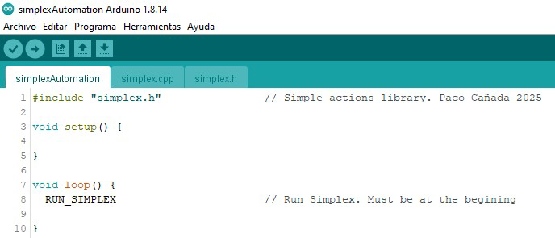

# simplex.h

Muchas veces queremos añadir algún elemento a nuestras maquetas con algún tipo de efecto
o pequeña automatización y consultando con nuestros amigos como implementarlo siempre
hay alguien que dice: “Eso con Arduino es más sencillo de hacer!”.

Os presento simplex.h una librería para Arduino para realizar animaciones y algo más en
nuestras maquetas con comandos simples y compatibles con la programación tradicional del
lenguaje Arduino.

**simplex.h** es una librería para Arduino que aprovechando la potencia del preprocesador del
lenguaje Arduino proporciona comandos simples para automatizar nuestras maquetas y es
plenamente integrable con el lenguaje Arduino.

## Librería

Para usar la librería sólo hay que copiar los archivos **simplex.h** y **simplex.cpp** al directorio donde se encuentra vuestro sketch, incluir la librería y en el **loop()** poner **RUN_SIMPLEX** al inicio:

Otra opción es descargar esta librería como archivo .zip y añadirla en el Arduino IDE desde el menú Programa -> Incluir Librería -> **Añadir biblioteca .ZIP ...**,  además también estarán disponibles los ejemplos en el menú **Archivo** y no necesitareis copiar los archivos **simplex.h** y **simplex.cpp** al directorio donde se encuentra vuestro sketch.

## Comandos

**IMPORTANTE** Entre el comando y el **(** no deben escribirse espacios ya que sino el
prepocesador generará un error al compilar el código.

### Comandos básicos

|Comando|Descripción|
|---|---|
|RUN_SIMPLEX |Procesa las acciones de simplex.h|
|SET_NAME(n,p) |Asigna un valor (0...255) a un nombre de constante (pin, etc.,..)|
|VAR_NAME(n) |Define el nombre de una variable|
|SET_VAR(n,p) |Dar un valor a una variable (entre -32768 a 32767)|
|PIN_OUT(p) |Define un pin como salida (relé, luces,...)|
|PIN_COIL(p) |Define un pin como salida de pulso (Bobina desvío,…)|
|PIN_EFFECT(p) |Define un pin como efecto de luz|
|PIN_SERVO(p) |Define un pin como servo (máx. 12: _MAX_SERVO)|
|PIN_INPUT(p) |Define un pin como entrada|
|PIN_BUTTON(p)| Define un pin como entrada anti rebote (Pulsador, final carrera…)|
|PIN_SENSOR(p) |Define un pin como una entrada de sensor|
|PIN_MODE(p,n) |Establece el modo de un pin (tipo PIN_OUT/ PIN_EFFECT)|
|PIN_TIME(p,n) |Establece el tiempo para un pin o velocidad de un servo|
|SET(p) |Activa pin de salida (tipo PIN_OUT/ PIN_EFFECT/ PIN_COIL)|
|RESET(p) |Desactiva pin de salida (tipo PIN_OUT/ PIN_EFFECT/ PIN_COIL)|
|SERVO(p,n) |Mover el servo a una posición (0..180)|
|ARRIVED(p) |Comprobar si el servo llegó a la posición|
|PRESSED(p) |Comprobar si se pulsó el botón|
|ACTIVE(p) |Comprobar si el sensor esta activo|
|FREE(p) |Comprobar si el sensor esta libre|
|FSM_NEW(n) |FSM, define el nombre de una nueva FSM (Multi FSM)|
|FSM_USE(n) |FSM, usar los estados correspondientes al FSM (Multi FSM)|
|FSM_NAME(n) |FSM, define el nombre de un nuevo estado|
|FSM_STATE(n) |FSM, comprobar estado actual|
|FSM_GO(n) |FSM, transición a un nuevo estado|
|SET_TIMER(p,n) |Arrancar un temporizador (máx. 4: _MAX_TIMERS)|
|TIMEOUT(p) |Comprobar si el temporizador acabó (máx. 4: _MAX_TIMERS)|
|WAIT(n) |Espera un tiempo procesando acciones simplex|
|WAIT_SERVO(p) |Espera que un servo llegue a la posición procesando acciones simplex|
|FUNCTION(n) |Define una función|
|CALL(n) |Llamar a una función|
|REPEAT(n) |Repetir comandos (2..65535 veces, máx. 4 bucles: _MAX_REPEAT)|
|AND(x,y) |Comprobar si ambas condiciones son verdaderas|
|OR(x,y) |Comprobar si al menos una condición es verdadera|
|NOT(x) |Negación lógica|
|EQUAL(x,y) |Comprobar si dos valores son iguales|

### Comandos DCC

|Comando|Descripción|
|---|---|
|PIN_DCC() |Usar pin de entrada DCC (_DCC_PIN)|
|DCC_ACC_RED(n) |Comprobar si el número de accesorio recibido está en rojo|
|DCC_ACC_GREEN(n) |Comprobar si el número de accesorio recibido está en verde|

## Manual

El manual de la librería lo podéis ver [aquí](doc/simplex_manual.pdf).

## Ejemplos
Los ejemplos del manual los podéis ver [aquí](examples/).

Hay una plantilla en blanco [aquí](examples/blank/).

## Videos

---

Paco Cañada

https://usuaris.tinet.cat/fmco/

https://fmcopaco.github.io/